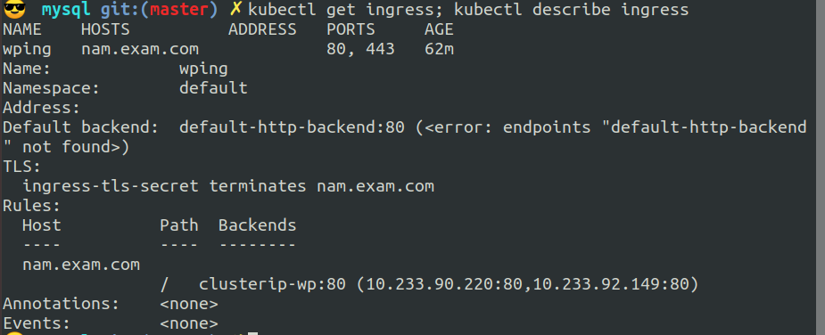
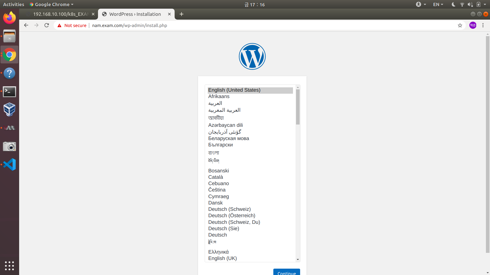
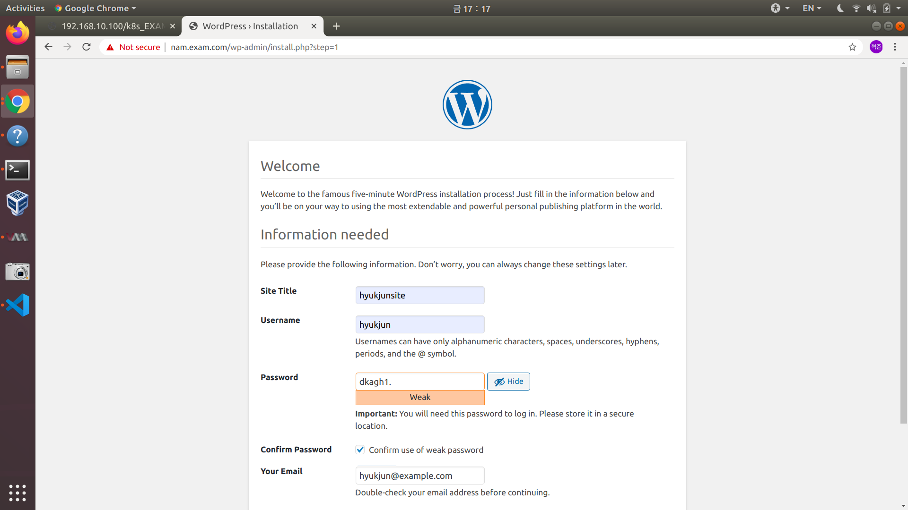
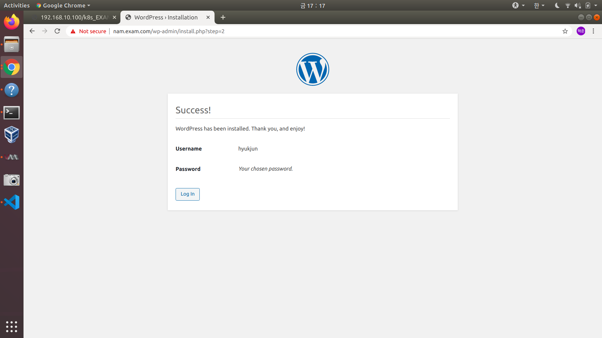
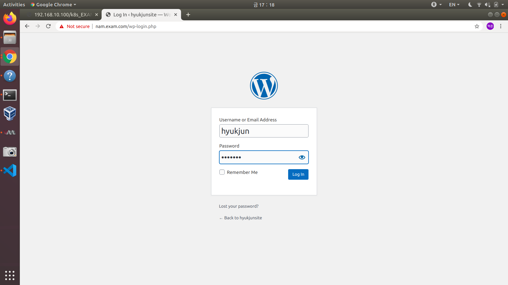
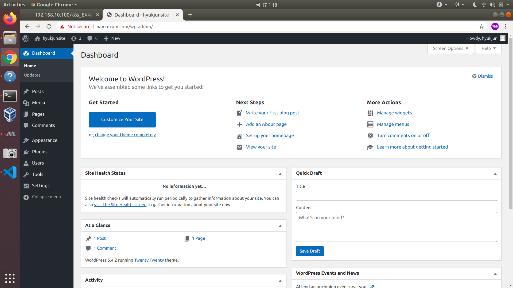

# <Kubernetes Native - Wordpress 애플리케이션 구축>

# 구성도

# Describe

### 1. Ingress TLS Termination

내부의 ClusterIP 서비스를 외부에 노출시키는 컨트롤러 로서,  TLS Termination 기술을 통해 외부와는 HTTPS 통신을 하고 내부에서는 HTTP 통신을 하게 되어 외부 보안과 내부의 서비스 속도, 성능을 향상시킬 수 있습니다.

### 2. Service: ClusterIP

쿠버네티스 클러스터 내부용 아이피 로서 노드 포트 같은 리소소를 사용하지 않는다.

- clusterip-wp

    Ingress를 통해 외부의 트래픽이 ClusterIP Service에 전해오면 ClusterIP Service는 내부의 파드들에게 트래픽을 전해줍니다. ClusterIP는 내부용 서비스로서 노드 포트를 사용하지 않아도 되므로 리소스를 아낄수 있습니다.

- clusterip-db

    slave db pod들은 read-only로써 단순 읽기 작업일 경우 부하분산을 통해서 트래픽을 관리할 수 있다.

### 3. Deployment: Wordpress(Replica:2, Liveness, Readiness)

파드를 제어하는 컨트롤러보다 상위 수준의 컨트롤러 리소스.

디플로이먼트는 애플리케이션(컨트롤러,파드)을 배포하고 선언적으로 업데이트를 수행하는 리소스

디플로이먼트 리소스를 이용해 전체(하위 레플리카셋)를 제어한다.

두 개의 복제본과 라이브니스, 레디니스 확인 가능

### 4. PVC: StorageClass(cephfs)

wordpress pod에 마운트

### 5. HPA: Deployment

오토스케일러 로서 컨트롤러에게 메트릭을 얻어와 설정된 정책에따라 파드를 오토스케일링 해주는 역할을 하는 에이전트 입니다.

### 6. Service: Headless

Wordpress Pod는 DB Master Pod의  IP 대신 Hostname 으로 통신해야 하므로  Headless service 를 사용해야 합니다. Headless Service는  FQDN으로 클라이언트 측 파드가 서버 측 개별 파드와 통신하게 해주는 서비스 입니다.

### 7. Statefulset: Mysql(Replica:2, Liveness, Readiness)

MySQL은 Stateful하게 관리되어야 하므로 파드 각각의 볼륨을 가지고 있어야 합니다. StatefulSet은 pvc template과 그안에 Storageclass를 이용해 이를 가능하게 해줍니다.

liveness, readiness

requests, pvc, storageclass

### 8. PVC: StorageClass(rbd)

DB Pod에 마운트 된걸 확인

### 9. HPA: Statefulset

오토스케일러 로서 컨트롤러에게 메트릭을 얻어와 설정된 정책에따라 파드를 오토스케일링 해주는 역할을 하는 에이전트 입니다.

### 10. PodAffinity 및  PodAntiAffinity (wp/db <-> wp/db)

wordpress, db 한 쌍씩 같은 노드 배치 확인

### 11. (기타) ConfigMap, Secret 등...

- MySQL ConfigMap

    마스터와 슬레이브를 독립적으로 제어할 수 있도록 하는 리소스로서 컨피그맵 볼륨으로 사용됩니다. 마스터는 복제 로그를 슬레이브로 제공하는 설정, 슬레이브는 읽기전용으로 쓰기를 금지하도록 하는 설정 입니다.

    

- Wordpress ConfigMap

    Wordpress pod 의 liveness probe에 사용할 컨피그맵 정의, 볼륨으로 사용

    

- TLS Termination
    - Secret

    

### 동작 확인이 필요한 리소스 동작 확인/설명

- Autoscaling

    부하 걸기전

    

    부하 건 후

    

    

### Wordpress 동작화면

